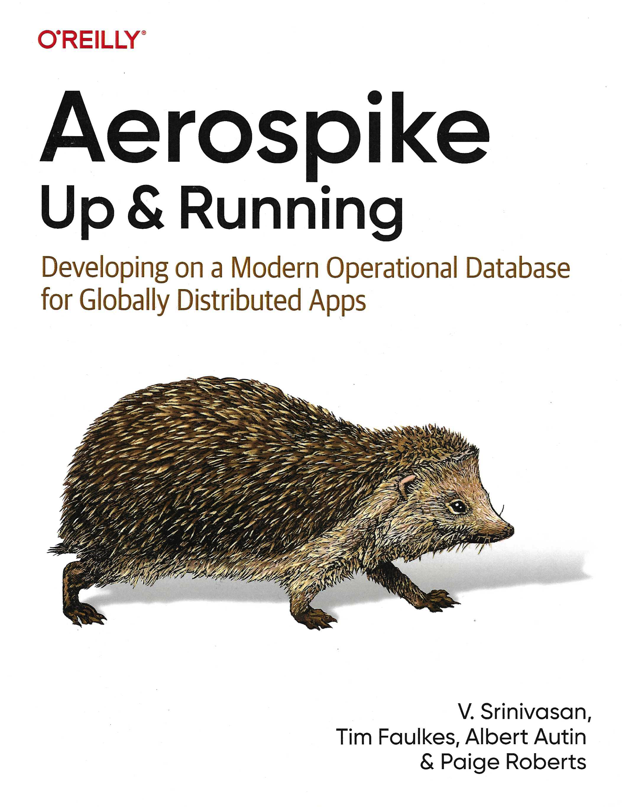

# Aerospike Up & Running

This repository contains companion code to the book: **Aerospike Up & Running** published by O'Reilly.

The code use the new "Fluent" client that employs the [Builder Pattern](https://en.wikipedia.org/wiki/Builder_pattern)

## The Builder Pattern

A flexible way to create complex objects
### What problem does it solve?
When an object has many optional parameters, or when its construction involves multiple steps, constructors become messy:

- Too many parameters
- Hard to read
- Easy to mix up arguments
- Hard to maintain

The Builder Pattern solves this by separating object construction from its representation.

### How it works
The pattern typically involves:
- Product → the object being built
- Builder → defines the steps to build the product
- Concrete Builder → implements those steps
- Director (optional) → orchestrates the building steps
- Client → uses the builder to get the final product

### Why developers love it
- Fluent, readable object creation
- Avoids telescoping constructors
- Supports immutability
- Easy to add new optional fields
- Great for complex multi-step construction

### Languages that use it (to name a few)
- Java
- Typescript
- Python
- C#
